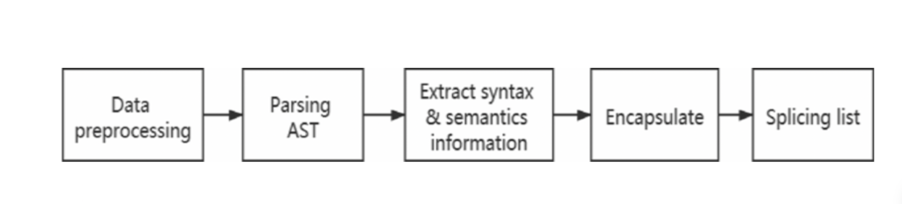

In the previous part, we briefly introduce the definition and structural characteristics of the AST. This part will introduce how to extract relevant information from the AST.

The dataset selected in our experiment is code segments in Python language, so the ast module in Python is used to process the dataset of source code. Firstly, we need to understand the actual process of converting Python code into byte code. Figure 3 shows the general process of processing Python code into byte code. From the figure, we can observe that AST is an intermediate product from Python source code to byte code. With the help of ast module, the source code structure can be analyzed from the perspective of the syntax tree.

In the experiment, we firstly convert the Python code segment into a string format and put it into the program, and then use the parse() function in ast module to parse the code segment to obtain the corresponding AST. Each node of the tree represents each variable information and syntax logic information in the source code. Then extract some key grammatical and semantic information and logical conversion information, in addition to extracting some attribute information related to variables and operators, then the main information extracted from the syntax tree is used as variable attributes and encapsulated into a function information object (FuncInfo) as a conversion object representing the main information of this code fragment.

For all code segments in the code dataset, after performing the above syntax tree analysis and information extraction operations, you can get a list structure composed of multiple function information objects. Each object represents the main information of a code segment. At this point, the operation of source code conversion ends, the main steps are shown in Figure 4, and then the similarity calculation is performed on the obtained object list.

Figure 4.
Source code conversion steps